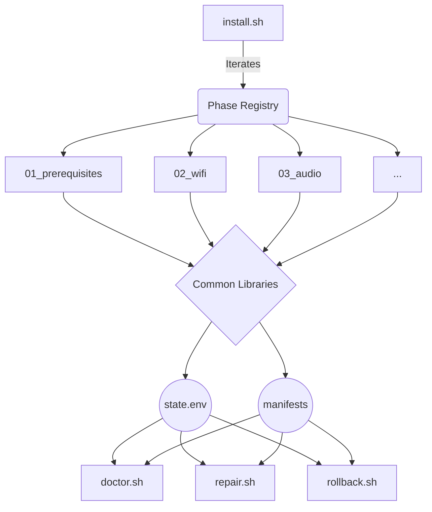

# MacBook Pro Linux Support Framework


A production-ready, highly modular offline installer and recovery framework designed to bring full hardware support to Intel MacBook Pros running Ubuntu (and other Debian-based distributions).

> [!CAUTION]
> **Disclaimer**  
> This project modifies system components, installs third-party DKMS modules, and replaces critical firmware. Please back up all important data before proceeding. Use at your own risk.

---

## 🏗 Project Architecture

This installer is built around a safety-first, declarative lifecycle rather than a monolithic script. The architecture decouples detection, orchestration, installation, and recovery.



---

## 💻 Supported Hardware

This framework is currently targeted and validated for **MacBookPro14,3** (15-inch, 2017).

| Component      | Status | Notes                       |
| -------------- | ------ | --------------------------- |
| Wi-Fi BCM43602 | ✅      | Offline firmware deployment |
| Audio CS8409   | ✅      | DKMS package                |
| Touch Bar (T1) | ✅      | DKMS package                |
| Bluetooth      | ✅      | Native kernel support       |
| Camera         | ⏳      | Planned                     |
| Suspend/Resume | ⚠️     | Experimental                |

> **Note:** Do not run this installer on untested Mac models unless you create a specific platform definition file.

---

## 📂 Repository Structure

The framework is organized into strictly delineated modules:

- **`install.sh`**: The main orchestrator. It manages execution context, runs migrations, loops through the phase registry, and generates reports. It contains *zero* installation logic.
- **`platforms/`**: Hardware definition files (e.g., `macbookpro14-3.sh`). Determines which chips, packages, and kernel versions are required for a specific Mac model.
- **`scripts/`**: Individual, idempotently designed installation phases (Wi-Fi, Audio, Touch Bar).
- **`common/`**: Shared libraries providing the `logging`, `backup`, `state`, `system`, and `package` APIs.
- **`checks/`**: Diagnostic modules used by `doctor.sh` to validate system health.
- **`repairs/`**: Granular fix modules used by `repair.sh` to correct individual broken components.
- **`assets/`**: Pre-downloaded, SHA256-verified firmware blobs and `.deb` packages (offline-first design).
- **`migrations/`**: State migration scripts executed automatically during version upgrades.
- **`doctor.sh`, `repair.sh`, `rollback.sh`, `uninstall.sh`**: Specialized lifecycle tools (see below).

---

## 🚀 Installation

The entire installation is offline-first. Ensure you have cloned this repository fully (including `assets/`).

### Standard Run
```bash
sudo ./install.sh
```

### CLI Options

The orchestrator supports a powerful CLI for targeted execution and debugging:

- `--dry-run` : Simulates execution without modifying the system.
- `--verbose`, `-v` : Increases logging verbosity.
- `--debug` : Prints full debug tracing.
- `--phase NAME` : Run only a specific phase (e.g., `sudo ./install.sh --phase wifi`).
- `--from-phase NAME` : Resume installation from a specific phase.
- `--skip NAME` : Skip a specific phase.
- `--list-phases` : Print all available installation phases.

Example: Re-run only the Touch Bar phase with debug logging:
```bash
sudo ./install.sh --phase touchbar --debug
```

---

## 🛠 Recovery Tools

This framework is built around distinct recovery mechanisms rather than a single script.

### 1. `doctor.sh`
The single source of truth for system health. It executes tests from `checks/` without altering the system.

**Exit Codes:**
- `0 (PASS)`: Hardware is operational.
- `1 (WARN)`: Packages installed, but module inactive (e.g., requires reboot).
- `2 (FAIL)`: Missing packages, failed DKMS builds, or broken symlinks.

**Output Formats:**
```bash
sudo ./doctor.sh --compact
sudo ./doctor.sh --json
```

### 2. `repair.sh`
A modular healing tool. It consumes `doctor.sh` JSON output to determine exactly which repair modules in `repairs/` to trigger.

```bash
sudo ./repair.sh --audio
sudo ./repair.sh --repair-id wifi_symlink
sudo ./repair.sh --all
```

### 3. `rollback.sh`
A transactional, safety-first undo tool. 
- **What it does:** Reverts the exact file modifications and symlinks recorded in `installer.manifest`, and restores original files from `backups.manifest`.
- **What it DOES NOT do:** It will never recursively delete directories (`rm -rf`), and it will never guess which dependencies to remove. It is strictly tied to the recorded installer state.

### 4. `uninstall.sh`
A dedicated purge script designed to permanently remove all framework configurations, logs, state files, and associated packages if you decide to completely leave the framework.

---

## ⚙️ Extending the Framework

### Adding a New Platform
To add support for a new Mac model:
1. Create `platforms/macmodelX-Y.sh`.
2. Define standard hardware variables (`PLATFORM_ID`, `BOARD_ID`, `WIFI_CHIP`, `AUDIO_PKG_NAME`, etc.).
3. The orchestrator will dynamically load this definition based on `/sys/class/dmi/id/board_name`.

### Migrations
Migrations live in `migrations/`. They exist to seamlessly upgrade the state of users running an older version of the installer to a newer one without requiring a full reinstall.
- The orchestrator checks `STATE_FILE` against the migrations directory and executes them sequentially.
- Once executed, a migration is marked `DONE` and never reruns.

---

## 💡 Troubleshooting & FAQ

#### The Broadcom BCM43602 board file issue
> **Q: Why does my 5GHz Wi-Fi not work out of the box on Ubuntu?**  
> **A:** Ubuntu occasionally ships an incorrect, truncated 339-byte board file (`brcmfmac43602-pcie.txt`) for MacBookPro14,3. This installer actively detects the 339-byte file footprint via `doctor.sh`, backs it up, and replaces it with the verified ~6KB board file used during kernel development, restoring full 5GHz functionality while preserving rollback capability.

#### Optional Firmware Warnings
> **Q: Why does `doctor.sh` warn about a missing `clm_blob` or `txcap_blob`?**  
> **A:** These are optional regulatory blobs requested by the Broadcom driver. While they optimize channel availability in specific regions, core Wi-Fi functionality operates perfectly without them. This generates a `WARN` rather than a `FAIL`.

#### DKMS Kernel Mismatches
> **Q: I updated my kernel, and now audio stopped working. What do I do?**  
> **A:** When Ubuntu upgrades your kernel, DKMS modules need to rebuild. If this fails silently, `install.sh` or `doctor.sh` will detect the kernel version mismatch (e.g., `Current kernel: 6.12.0` vs DKMS build) and prompt you to run `sudo dkms autoinstall` or trigger `repair.sh --audio`.

#### Reloading vs. Rebooting
> **Q: Do I need to reboot after installation?**  
> **A:** The installer deliberately avoids forcibly unloading network or audio modules (`modprobe -r`) to prevent crashing active user sessions or severing SSH connections. Therefore, a manual `modprobe` reload or a system reboot is recommended to activate the drivers after installation.

#### Rollback vs. Uninstall
> **Q: What is the difference between rollback and uninstall?**  
> **A:** `rollback.sh` is a transactional *undo* command. It simply reverts the last installation session back to its pristine pre-install state using backup manifests. `uninstall.sh` is a destructive *purge* command that rips out all traces of the framework entirely.

---

## 👨‍💻 Development

### Coding Guidelines
- **Language**: Bash 5.0+ strictly enforced.
- **Linter**: Code must be 100% `ShellCheck` clean.
- **Commits**: Small, atomic, and logically separated (e.g., `feat(wifi): ...`).
- **Dependencies**: The core orchestration relies on zero external dependencies (`jq`, `curl`, etc., are avoided to guarantee offline operation).
- **Execution Context**: Do not use `SCRIPT_DIR="$(pwd)"` dynamically inside modules. Always source `common/context.sh` and utilize pre-defined paths like `INSTALL_ROOT` and `ASSETS_DIR`.

---

## 🗺 Roadmap

Future enhancements currently planned:
- FacetimeHD Camera support module (requires complex firmware extraction integration).
- Native Suspend/Resume hibernation patching.
- Automated system-level GRUB parameter tuning (e.g., `intel_iommu=on`).

---

## 📜 License

This project is licensed under the MIT License.
